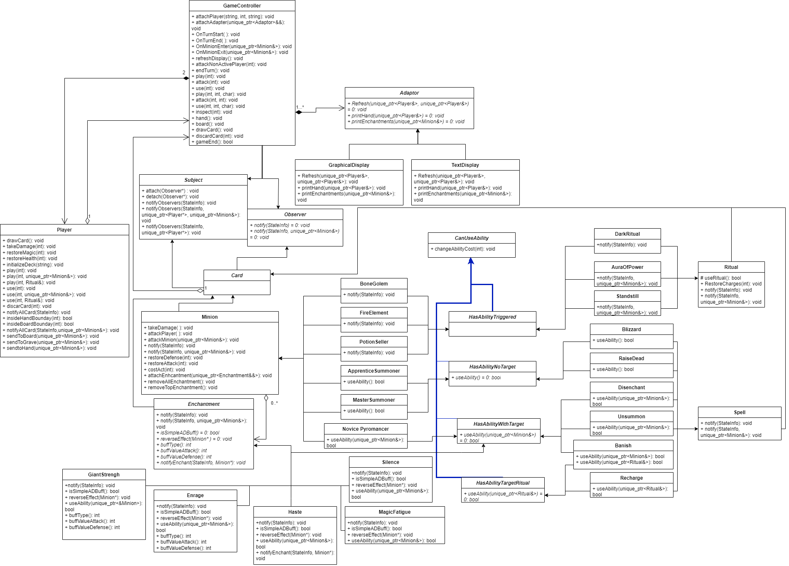

# CS246 Assignment 5 Design Document
Group Member: c62gao, c63zhu, vlisita
# Introduction:
We choose to make the game "Sorcery" to present our learning outcomes about object-oriented programming. We decided to use some design patterns we learned in class, such as MVC, Observer, and Decorator to solve certain design problems, such as handling different displays. Some of them really helped, but some of them proved to be unnecessary. We also got our own "design patterns" derived from the taught ones to meet our specific requirements. Unique pointers are used to replace all "new/delete" combinations, which should prevent most leak memory as they are designed to.
# Table Of Contents:
- [CS246 Assignment 5 Design Document](#cs246-assignment-5-design-document)
- [Introduction:](#introduction)
- [Table Of Contents:](#table-of-contents)
- [Overview](#overview)
- [Updated  UML](#updated--uml)
- [Design](#design)
  - [APNAP pattern, triggered ability, ritual](#apnap-pattern-triggered-ability-ritual)
  - [APNAP pattern continues, Event Triggering, Cards Transfering](#apnap-pattern-continues-event-triggering-cards-transfering)
    - [Problems With Original Design:](#problems-with-original-design)
    - [What we changed to handle these problems:](#what-we-changed-to-handle-these-problems)
  - [Enchantments](#enchantments)
    - [Problems With Original Design:](#problems-with-original-design-1)
    - [What we changed to handle these problems:](#what-we-changed-to-handle-these-problems-1)
  - [Play/Use cards with activated Ability no target / with target](#playuse-cards-with-activated-ability-no-target--with-target)
- [Resilience to Change](#resilience-to-change)
  - [GameController](#gamecontroller)
  - [Player](#player)
  - [New Cards](#new-cards)
    - [New Ritual](#new-ritual)
    - [New Spell](#new-spell)
    - [New Minion](#new-minion)
    - [New Enchantment](#new-enchantment)
  - [New types of Cards](#new-types-of-cards)
- [Answers to Questions](#answers-to-questions)
- [Final Questions](#final-questions)

# Overview
The system of our game is encapsulated inside the class called `GameController`. After the main function received input from either the initialization file or standard input, it calls the corresponding method provided by the `GameController` immediately. Specifically, the `GameController` provides `attack, play, use, inspect, hand, board, draw and discard` (in test mode only). The `GameController` owns two `Player` class (`unqiue_ptr<Player>`) and a vector of `Adaptor `class. The `Player` class is designed to handle specific commands for a player as well as store necessary information for a player to play the game. It contains a player's `hand, deck, board, graveyard` and methods for a player to `attack, play, use, inspect, check hand, check board, draw cards and discard cards` (test mode only). The `GameController` will call the corresponding method from the active player to perform the actual action after receiving commands from the main function. The `Adaptor` class is an abstract superclass for all supported interfaces. It contains three common methods among all interfaces that could show the board, the hand, and the minion respectively. When it is time to show any of the three above, the `GameController` will traverse the vector and call the same method that could output to an appropriate interface with appropriate information. The `MVC pattern` is used here to out the internal format of cards to what could be seen on the interfaces. The `GameController` is responsible for keeping the `APNAP pattern` as well. The `Observer Pattern` is used here where the `GameController` is the `subject` and different cards on the board are `observers`. The `GameController` will `notify` cards on the board with the event information when the turn starts or ends and when any minion enters or exits. The `GameController` will provide a reference, of the minion that exits or enter, to the cards on the board to trigger any effect that is intended.

The cards are implemented using multiple inheritances to maximize the use of existing code. Above all, class `Card` stores the basic information about a card including its `name, cost, state(location) and owner`. class `Minion`, class `Spell`, class `Enchantments`, and class `Ritua`l only inherit from `Card` and they only contain their unique properties. For example, class `Ritual` has `charges and costs per use`, class `Minion` has `attack and defense`. For any card that does not have an ability at all (most are minions as other cards have some effects at least), those four classes are enough for it by setting the appropriate name and cost in one of the ctors of them. Then, for any card that does have an ability (treat `Enchantments` as cards with ability), it will first inherit from one of the four types of cards above and also inherit from one or more derived classes of abstract class `CanUseAbility` depending on the type of target of the ability to achieve better code reuse to get the power of using Ability.

# Updated  UML

# Design
## APNAP pattern, triggered ability, ritual
The `GameController` and `Observer Pattern` together achieve this `APNAP pattern`. As described in the overview, the `GameController` can notify cards on the board. It is done through four similar public methods inside GameControlelr: `onTurnStart, onTurnEnd, onMinionEnter, onMinionExit`. All of them will notify the Active Player's cards that are on board first, then Non-Active Player goes second. The card's `state(location)` is set when it transfers from one place to another(details below). Each method will pass the corresponding `stateInfo` to those cards being notified. For example, `stateInfo::onTurnStart` for `onTurnStart` method and etc... `onMinionEnter` and `onMinionExit` methods will also pass a reference to the minion enter/exit the board. In this way, minions with triggered abilities (including restore 1 action point on turn start) and Rituals could be triggered successfully and any triggered ability that needs to apply effects to a minion could use the reference to get their target. Then, as the `active player's cards are notified first`, the `APNAP pattern `is achieved here.

## APNAP pattern continues, Event Triggering, Cards Transfering
### Problems With Original Design:
However, only these four public methods will not make the system work as expected. When and which one to call is left undecided. Also, there is no way to check who is the active player at one turn now as the `GameController` just owned two `Player` classes. And as described above, how cards transfer from one place to another (such as deck to hand, hand to board) is not clear as well.

### What we changed to handle these problems:
The GameController now get `uniquen_ptr<player>* activePlayer` and `uniquen_ptr<player>* nonActivePlayer` to two players of type `uniquen_ptr<player>`, so that activePlayers could be changed and determined. There is a command called end in main, which will then call `endTurn` method in GameController. `endTurn` will simply call `onTurnEnd` method first, swap(activePlayer, nonActivePlayer), then call 'onTurnStart' method. Cards are transfered using `sendToBoard, sendToHand, sendToGrave` from the `Player` class. The `Player`class now has a `GameController*`, which is set when constructing. `onMinionExit` will then be called inside `SendToGrave` and  `onMinionEnter` will be called inside `SendToBoard`. These three send methods simply push_back(move(target)) in order to send target card to board/hand/grave. The original place where the target come from will be erased to avoid segmentation fault.
## Enchantments
### Problems With Original Design:
The above Event Triggering system raises a problem for enchantments, enchantments such as Haste need a minion target to apply its effect on turn start. Together with the problem that removing enchantment requires reversing its effect, which also needs a minion as a target.
### What we changed to handle these problems:
Instead of notifying enchantments the same way as minions and rituals. We decided to let minions own a vector of enchantments applied to it. The Decorator Pattern is our original plan for enchantment but it is not as convenient as we expected. Instead, when the minion is notified, it will relay the `stateInfo` by traversing the attached Enchantments in the vector and calling `notifyEnchant` of each, passing itself and the `stateInfo` to that enchantment. In this way, enchantments similar to `Haste` could be triggered successfully.
## Play/Use cards with activated Ability no target / with target
As mentioned in the overview, there is an abstract class called `CanUseAbility`. Four derived classes are `HasAbilityWithTarget`, `HasAbilityWithTargetRitual`, `HasAbilityNoTarget`, `HasAbilityTriggered`. The first three contains `useAbility(unique_ptr<Minion>& target)`, `useAbility(unique_ptr<Ritual>& target)`, `useAbility()` respectively. The last class contains nothing. Any card with ability is also inherited from one of four derived classes here depending on the type of the ability besides its base card type. Below are some examples:
```c++
class Blizzard: public Spell, public HasAbilityNoTargett{
  ...
  bool useAbility() override;
  ...
};
class FireElemental : public Minion, public HasAbilityTriggered{
  ...
};
```
Then, instead of inheriting from `HasAbilityTriggered`, the card should override the corresponding `useAbility` method, which will be called inside `play` and `use` methods from the `Player` class. Together with dynamic_cast, we could have an easy way of checking the ability type of a given card by dynmic_cast its raw pointer like follows
```c++
//assume card has a type unique_prt<Card>;
if 
```
And call the appropriate version of `useAbility` 


# Resilience to Change

## GameController
## Player
## New Cards
### New Ritual
### New Spell
### New Minion
### New Enchantment
## New types of Cards
# Answers to Questions
Question: How could you design activated abilities in your code to maximize code
reuse?

Answer:
We notice that spell effects, ritual effects, and minions’ activated abilities are
similar. To maximize code reuse and minimize code duplication we have
superclasses HasAbilityNoTarget/TargetMinion/TargetRitual such that could be
inherited to provide the abstract useAbility() method for all three types of cards to
override and use.

Question: What design pattern would be ideal for implementing enchantments?
Why?

Answer:
The decorator design pattern would be ideal since we want to change the
behavior or states of minions at runtime. We will have Minion as the Component
and different enchantments as ConcreteDecorators.

Question: Suppose we found a solution to the space limitations of the current user
interface and wanted to allow minions to have any number and combination of
activated and triggered abilities. What design patterns might help us achieve this
while maximizing code reuse?

Answer:
Decorator Pattern could be used here. We could set activated and triggered
abilities as decorators that could be added to the minions. We can give an extra
parameter called index for overloading the useAbility method for activated abilities so
that only a specific one is selected and triggered. As for triggered abilities, we could
go through the whole linked list for the minions when it is notified by the
GameController when an event happens and check for the triggered conditions one
by one.

Question: How could you make supporting two (or more) interfaces at once easy
while requiring minimal changes to the rest of the code?

Answer:
We will use the MVC/Observer design pattern and send the internal
representation of the board to each class that can translate the data to the
information on the interface(works similarly to adapters). In this way, we could keep
the rest of the code unchanged. And adding new interfaces only requires new
“adapters” which do the translations similarly to others
# Final Questions
Question: What lessons did this project teach you about developing software in teams?


Question: What would you have done differently if you had the chance to start over?